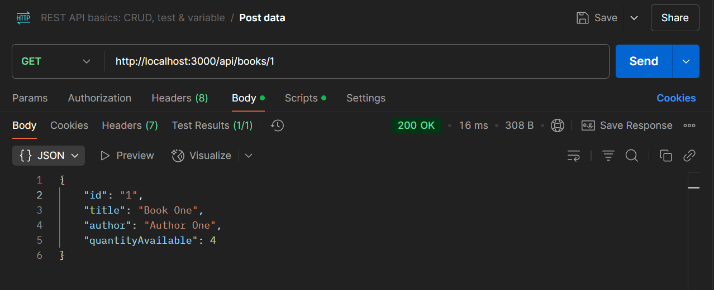

# API de Gerenciamento de Livros e Empréstimos

Esta é uma API RESTful desenvolvida em Node.js e Express para gerenciar um sistema simples de biblioteca, permitindo o cadastro e gerenciamento de livros e empréstimos, com autenticação de usuários via JWT.

## Funcionalidades Principais

*   **Autenticação:** Registro e Login de usuários com tokens JWT.
*   **Gerenciamento de Livros:** CRUD completo para livros (Criar, Ler, Atualizar, Deletar).
*   **Gerenciamento de Empréstimos:** Criação e devolução de empréstimos de livros por usuários autenticados.

## Tecnologias Utilizadas

*   **Node.js:** Ambiente de execução JavaScript.
*   **Express:** Framework web para Node.js.
*   **jsonwebtoken:** Para geração e verificação de tokens JWT.
*   **bcrypt:** Para hashing de senhas.
*   **uuid:** Para geração de IDs únicos.
*   **dotenv:** Para gerenciamento de variáveis de ambiente.

## Pré-requisitos

*   Node.js (versão 14 ou superior recomendada)
*   npm (geralmente vem com o Node.js)

## Instalação

1.  Clone o repositório:
    ```bash
    git clone https://github.com/eduardomatos7/library-app-auth.git
    cd library-app-auth
    ```
2.  Instale as dependências:
    ```bash
    npm install
    ```
3.  Crie um arquivo `.env` na raiz do projeto, baseado no exemplo abaixo, e configure suas variáveis:
    ```dotenv
    # filepath: .env
    PORT=3000
    JWT_KEY=sua-chave-secreta-super-segura
    ```

## Como Executar

Para iniciar o servidor em modo de desenvolvimento (com recarregamento automático):

```bash
npm run dev
```

## Exemplos de Uso

Abaixo estão algumas telas que demonstram as funcionalidades da API sendo utilizadas através da ferramenta Postman.

<table>
  <tr>
    <td align="center" valign="top">
      <div style="width: 350px; text-align: left;"><strong>1. Login de Usuário:</strong></div><br/>
      
      <br/><em style="text-align: justify; display: inline-block; width: 350px;">Realiza o login de um usuário previamente cadastrado, retornando um token JWT para autenticação nas rotas protegidas.</em>
    </td>
    <td align="center" valign="top">
       <div style="width: 350px; text-align: left;"><strong>2. Listagem de todos os livros:</strong></div><br/>
      
      <br/><em style="text-align: justify; display: inline-block; width: 350px;">Exibe todos os livros cadastrados no sistema. Esta rota não requer autenticação.</em>
    </td>
  </tr>
  <tr>
    <td align="center" valign="top">
       <div style="width: 350px; text-align: left;"><strong>3. Ver um livro específico:</strong></div><br/>
      
      <br/><em style="text-align: justify; display: inline-block; width: 350px;">Busca e exibe os detalhes de um livro específico utilizando seu ID.</em>
    </td>
    <td align="center" valign="top">
       <div style="width: 350px; text-align: left;"><strong>4. Devolução do empréstimo:</strong></div><br/>
      
      <br/><em style="text-align: justify; display: inline-block; width: 350px;">Registra a devolução de um livro emprestado. Requer autenticação do usuário que realizou o empréstimo.</em>
    </td>
  </tr>
</table>